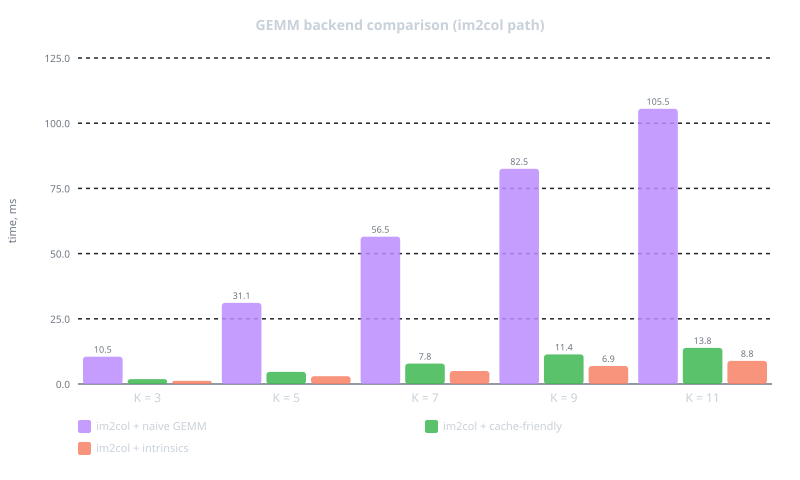
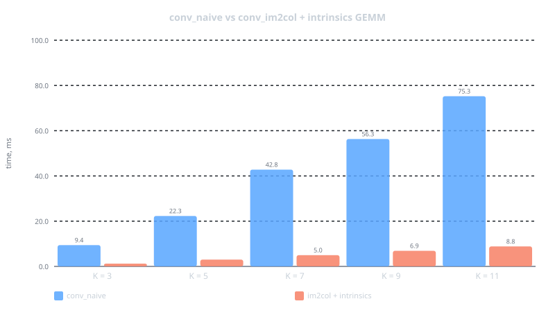
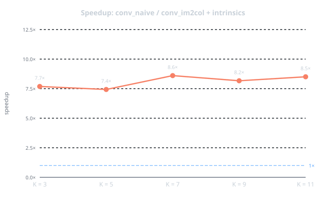

# Im2col: Direct Convolution vs. im2col + GEMM

Comparison of two 2D convolution algorithms for 4D float tensors in C++20.

## Algorithms

### Naive (direct) convolution

Computes the output directly via nested loops. For an input tensor of shape
$[N, C, H, W]$, a kernel of shape $[C_{\text{out}}, C_{\text{in}}, K, K]$ (with $C_{\text{out}} = C_{\text{in}} = C$),
and fixed $\text{stride} = 1$, $\text{padding} = 0$, the formula is:

```math
\text{output}[n,\, oc,\, oh,\, ow]
= \sum_{ic=0}^{C-1}\sum_{kh=0}^{K-1}\sum_{kw=0}^{K-1}
  \text{input}[n,\, ic,\, oh+kh,\, ow+kw]
  \cdot
  \text{kernel}[oc,\, ic,\, kh,\, kw]
```

Output shape: $[N,\, C,\, H_{\text{out}},\, W_{\text{out}}]$ where $H_{\text{out}} = H - K + 1$, $W_{\text{out}} = W - K + 1$.

Complexity: $O(N \cdot C_{\text{out}} \cdot H_{\text{out}} \cdot W_{\text{out}} \cdot C_{\text{in}} \cdot K^2)$.

### Explicit im2col + GEMM

Reduces convolution to a single matrix multiplication in two steps.

**Step 1 — im2col.**
For each sample `n`, the receptive-field patches of the input are unrolled into
a matrix $\text{col}$ of shape $(C \cdot K^2) \times (H_{\text{out}} \cdot W_{\text{out}})$.
Each column of $\text{col}$ contains the $C \cdot K^2$ values seen by one output position,
laid out in the same order as the flattened kernel.

```math
\text{col}[\,c \cdot K^2 + kh \cdot K + kw,\;\; oh \cdot W_{\text{out}} + ow\,]
= \text{input}[n,\, c,\, oh+kh,\, ow+kw]
```

The explicit matrix is allocated in memory, so overlapping patches are duplicated.
Memory overhead: $C \cdot K^2 \cdot H_{\text{out}} \cdot W_{\text{out}}$ floats per sample — up to $K^2$ times
the input size for large kernels.

**Step 2 — GEMM.**
Reshape the kernel to a matrix $W$ of shape $C_{\text{out}} \times (C \cdot K^2)$ and compute:

```math
\text{output}_n = W \times \text{col}
\qquad \bigl[C_{\text{out}} \times (H_{\text{out}} \cdot W_{\text{out}})\bigr]
```

The result is written back as $\text{output}[n, :, :, :]$.

Three GEMM implementations are provided and compared:

| Variant | Key idea |
|---|---|
| **Naive** | `i→j→p` loop order; column-wise access to B — cache-unfriendly |
| **Cache-friendly** | `i→j→p` tiled to fit L1; 8-wide scalar unroll; `__restrict__` enables auto-vectorisation |
| **Intrinsics** | ARM NEON 2× unrolled accumulator chains to hide FMA latency |

---

## Build

```bash
cmake -B build -DCMAKE_BUILD_TYPE=Release
cmake --build build -j
```

Run tests:

```bash
cmake -B build -DCMAKE_BUILD_TYPE=Debug -DBUILD_TESTING=ON
cmake --build build -j
ctest --test-dir build --output-on-failure
```

Run benchmarks and generate charts:

```bash
./build/im2col_bench \
    --benchmark_repetitions=7 \
    --benchmark_report_aggregates_only=true \
    --benchmark_format=json \
    --benchmark_out=docs/results.json

python3 bench/gen_charts.py
```

---

## Results

### Platform

| | |
|---|---|
| **CPU** | Apple M4 |
| **Cores** | 10 (performance + efficiency) |
| **L1d cache** | 64 KB (128-byte cache line) |
| **L2 cache** | 4 MB |
| **RAM** | 16 GB unified memory |
| **SIMD** | ARM NEON (128-bit, 4× f32 per lane) |
| **Compiler** | Apple Clang 17, `-O3 -march=native` |

**Benchmark setup:** N = 2, C = 32, H = W = 32. Median over 7 repetitions.

---

### Convolution methods — time per call (ms)

| K | conv_naive | im2col + naive GEMM | im2col + cache-friendly | im2col + intrinsics | speedup¹ |
|:-:|--:|--:|--:|--:|--:|
|  3 |  9.43 |  10.45 |  1.86 |  1.23 | **7.7×** |
|  5 | 22.29 |  31.10 |  4.64 |  3.00 | **7.4×** |
|  7 | 42.78 |  56.48 |  7.83 |  4.97 | **8.6×** |
|  9 | 56.32 |  82.50 | 11.36 |  6.89 | **8.2×** |
| 11 | 75.26 | 105.52 | 13.84 |  8.85 | **8.5×** |

¹ speedup = conv_naive / im2col + intrinsics.

### GEMM variants within the im2col path

| K | naive GEMM | cache-friendly | intrinsics | cache / naive | intrin / naive |
|:-:|--:|--:|--:|--:|--:|
|  3 |  10.45 |  1.86 |  1.23 | 5.6× |  8.5× |
|  5 |  31.10 |  4.64 |  3.00 | 6.7× | 10.4× |
|  7 |  56.48 |  7.83 |  4.97 | 7.2× | 11.4× |
|  9 |  82.50 | 11.36 |  6.89 | 7.3× | 12.0× |
| 11 | 105.52 | 13.84 |  8.85 | 7.6× | 11.9× |

---

### Charts

**GEMM backend comparison**



**conv_naive vs conv_im2col + intrinsics**



**Speedup over conv_naive**



---

## Conclusions

**im2col + naive GEMM is slower than direct convolution** because building the
`col` matrix costs an extra memory pass and the naive `i→j→p` GEMM loop
accesses B column-by-column, thrashing the cache.

**A well-optimised GEMM reverses the picture.** The cache-friendly variant
(tiled loops, `__restrict__`, 8-wide scalar unroll) already beats `conv_naive`
by 5–7×. Adding NEON intrinsics with dual-accumulator unroll brings a further
1.5×, reaching **7–9× speedup** overall.

**The advantage grows with kernel size:** larger K raises GEMM arithmetic
intensity relative to the fixed im2col overhead, so the gap widens from 7.7×
at K = 3 to 8.5× at K = 11. The cost is memory — explicit im2col duplicates
overlapping patches, consuming up to $K^2$ times more data than the raw input.
